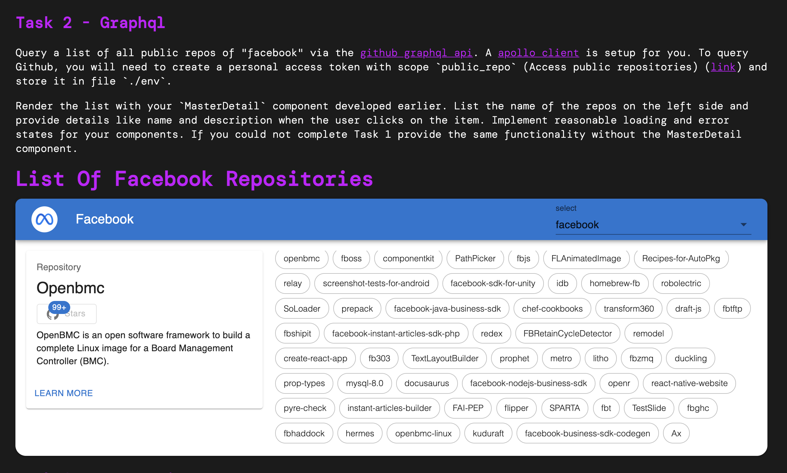

# hackathon-react

## Time

The hackathon is expected to take ca. 1h to complete (excl. debrief session).

## Questions

If you have questions during the challenge, please send a short mail.

## Submission

Please send back your results as ZIP file.


## Install

Requires node and yarn or npm to be installed.

```
yarn
```

## Run

```
yarn start
```

## Tasks

Find the tasks in `src/App.tsx`


## Solution



